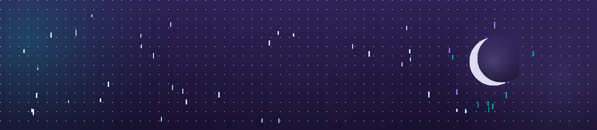

# Kokuu

**雨落下之后，就交给时间。**

个人开发者 · 非商业化 · 用爱发电

---

## 在做

| | |
| --- | --- |
| [kokuu-auth](https://github.com/KokuuStudio/kokuu-auth) | 皮肤站 + 积分经济：Blessing Skin 定制内核与插件族，一个仓库装完整条链路 |
| [kokuu-panel](https://github.com/KokuuStudio/kokuu-panel) | Minecraft 服务器管理平台：节点纳管、玩家档案、跨服封禁、操作审计 |
| [kokuu-site](https://github.com/KokuuStudio/kokuu-site) | <https://kokuu.org> 官网，零依赖单文件静态站 |
| Thaumcraft 6 → 1.20.1 | 社区移植，仓库私有，还没到能见人的程度 |

---

## 技术栈

Laravel / PHP · Vue 3 · Node.js · Java（Spigot / Paper 插件）· SQLite / MySQL · Docker Compose

---

[官网](https://kokuu.org) · [论坛](https://chat.kokuu.org) · [皮肤站](https://auth.kokuu.org)

